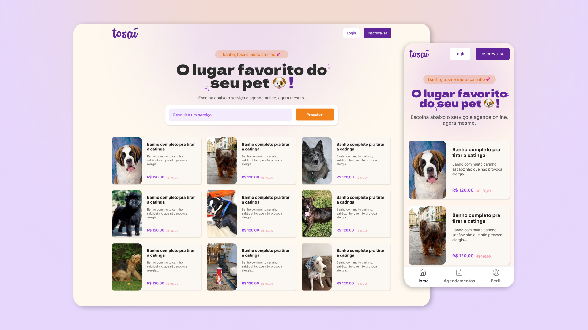

# Tosaí - Serviços de banho e tosa

### Links - Acesso rápido

- 🎨 <a href="https://www.figma.com/design/Wbf1jA3TfmbtoGNo0OZoSS/%5BTRIPLETEN%5D-Projeto-Final?node-id=0-1&t=BQGgege4Hg1hkTJ9-1">Protótipo Figma</a>
- 🌐 <a href="https://tosai.com.br">Deploy / Ver online</a>

<div>
  
</div>

## Sobre o projeto

Tosaí é um projeto idealizado e desenvolvido por mim (Herison Pereira), como projeto final de conclusão do curso de desenvolvimento web do bootcamp da TripleTen. O principal objetivo era a criação de uma aplicação front-end, que utilizasse das principais ferramentas que aprendemos durante toda a jornada. Como metodologia BEM, HTML, CSS, JavaScript, React, consumo de API REST de terceiros, entre outros.

### Stack

Para atender ao requisito de consumo de API de terceiros, utilizei Supabase, onde ele cria uma API REST automatica para cada tabela criada no banco de dados.

Além disso, fiz uso de ferramentas e tecnologias como:

- Figma para desenhar todo layout
- HTML, CSS e muito JavaScript
- React com Next.js
- Suspense API do React
- Metodologia BEM
- Tailwindcss

### Melhorias

Algumas melhorias possíveis para o futuro:

- Login e registro de usuário
- Agendamento online
- Cadastro dos pets
- Checkout com pagamento online
- Área de administração para o Petshop

## Getting Started

Primeiro instale todas as depedências com:

```bash
npm install
```

Duplique o arquivo `.env.exemple`, renomei para apenas `.env.local` e insira os respectivos valores de cada variável.

> Nota: `BASE_URL` e `SUPABASE_CLIENT_ANON_KEY` são variaveis referentes a API REST do Supabase. Para funcionar corretamente na aplicação, você precisa criar um projeto no Supabase e ter uma tabela pública com as seguintes colunas: id, title, description, full_price, current_price e image.

Em seguinda, inicie o ambiente de desenvolvimento:

```bash
npm run dev
```

Por padrão, o servidor será executado na porta 3000, ficando disponível no endereço local de http://localhost:3000

## Deploy

Para iniciar o servidor em modo de produção, primeiro execute:

```bash
npm run build
```

Se tudo deu certo, e não tiver nenhum aviso de erro, você pode iniciar o servidor de produção com:

```bash
npm run start
```

Novamente a porta padrão é a de 3000. Você pode alterar a porta de acordo com a documentação do Next.js, aqui: https://nextjs.org/docs/app/api-reference/next-cli#production
